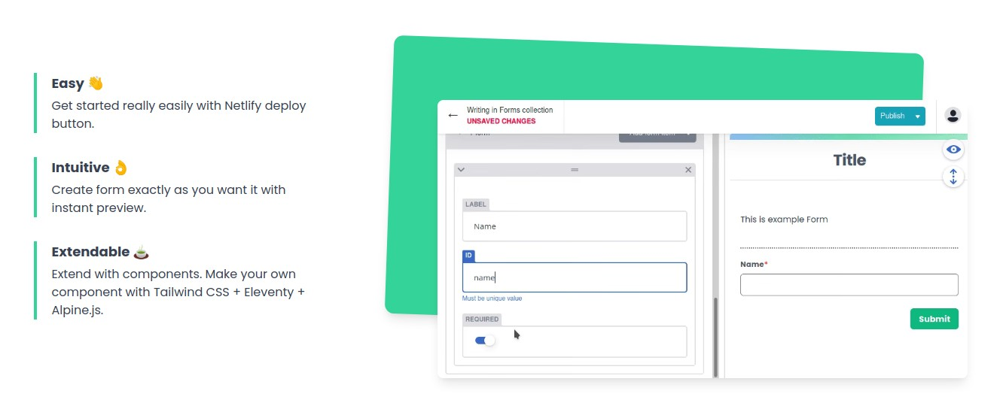
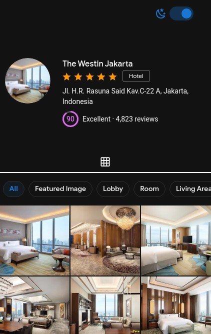

Employer seems to love to ask for portfolio. So for now I just made this page.

## Personal project

### Staticform.click

- [Github link][1]
- Website: [staticform.click](https://staticform21.netlify.app/)

A website that I made for people to make their own form builder website with JAMStack. I played with Tailwind CSS and Alpine.js here. I also wrote little documentation for it.

This project goes unpublished since I don't want people unknowingly share their WhatsApp number / API key freely in GitHub repo if they left it as public repo. I still feel there is a way to make this project more useful.

The staticform.click that is a valid domain that I bought, but I experience it sometimes out, so I use the netlify domain instead. I don't trust this particular domain provider anymore...

### Nuxt Vuetify Hotel Gallery

- [Github link](https://github.com/zulvkr/wbnuxtvuetify)
- [Website](https://brave-payne-6e0dd1.netlify.app/)

A quickie one page website made for a code challenge for an interview. The image was provided by the interviewer so I'm not sure how long they will live in the internet.

### Discord bot

[Discord bot GitHub][2]

A discord bot in progress. I and some friends make it as a side project in our Bootcamp.

### Yajmaa

- [Github](https://github.com/zulvkr/yajmaa)
- [website: yajmaa.netlify.app](https://yajmaa.netlify.app/)

An unfinished CRUD git based web app that I started with the simplest stack possible: Static site generator, vanilla js and Bulma CSS to iterate as fast as possible.

Along the way I decided to add Vue.js, gulp, sharp, babel, sass, \[and, more\]. In the end, my initial decision to use a simple known stack became a burden and the complexity of this project was getting higher due to the unusual stack. I want to spare my brain cells from this torture so it's abandoned now.

## Courses project

### Fullstack JS bootcamps bite sized project

This part is projects I made for the sake of completion of JS Fullstack Bootcamp by Flavio Copes. I explored some of the projects further, nonetheless, these projects are rather simple, but it reflects some bits of understanding of each technology.

- [REST API][3]

REST API with mongodb and express little project on JS fullstack bootcamp. My first iteration with actual REST API, finally

- [React - Github Users][4]

A client side react consuming GitHub REST API. Just a boring one. 

- [GitHub GraphQL API][5]

A client side JS + Express consuming GitHub GraphQL API. Alright, this is my first time fetching GraphQL.

- [Twitter Clone][6]

A messaging boards made with Redis and express. This is my first exposure with redis. Pretty neat.

- [Airtable shop][7]

Consuming airtable API. Just that.

- [Next RSS reader][8]

RSS reader made with Next.js. I just copied most of our Instructor code. But due to Next.js version just incremented to 11, the code has error and some fix was performed. It's a great framework!

### PHP & MYSQL Ninja Course Project

[GitHub Link](https://github.com/zulvkr/learnphp/tree/master/project)

This is the most complex project that I attended to. It's based on [a book from Sitepoint](https://www.sitepoint.com/premium/books/php-mysql-novice-to-ninja-6th-edition). The entire book is one big project of CRUD app made with vanilla PHP, no library.

It's quite hard to finish this course, zero library... Ow, man... I am a confused ninja now. I learned a lot and I gained some appreciation of object oriented PHP. I also learned some cool SQL ninja skill.

PHP sure has changed and gained some static typing ability, but I still felt that PHP as a language is harder to learn correctly.

### Laravel

[GitHub Link](https://github.com/zulvkr/lvl-example)

This is a project based on traversy media "Laravel Crash Course" video. I found that Laravel is amazing monolithic framework. So much magic that helps you iterate faster! The ORM is OK and many people praise it to the sky. It's PHP though 😞.

### Django

[GitHub Link](https://github.com/zulvkr/django-tutorial)

This is my take on django official tutorial. And my first python project. Still in progress..

[1]: https://github.com/zulvkr/StaticForm
[2]: https://github.com/JS-Bootcamp-Study-Group/discord-qa-bot
[3]: https://github.com/zulvkr/REST_API
[4]: https://github.com/zulvkr/react-github-users
[5]: https://github.com/zulvkr/githubapiv3
[6]: https://github.com/zulvkr/flipperfresh
[7]: https://github.com/zulvkr/airtable-shop
[8]: https://github.com/zulvkr/next-rss
